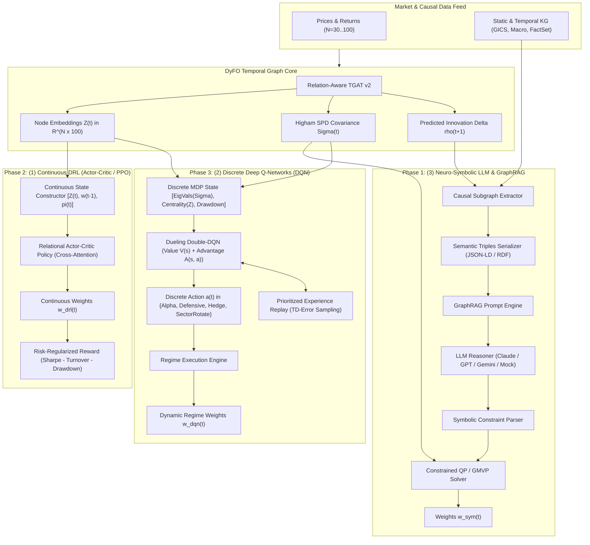

# Architecture & Technical Design: Neuro-Symbolic LLM, Continuous DRL & Discrete DQN

**Feature ID**: `neurosymbolic-drl-dqn-advances`  
**Base Branch**: `feat/neurosymbolic-drl-dqn-advances`  
**Status**: In Progress  

---

## 1. System Architecture Diagram



---

## 2. Component Design & Mathematical Formulations

### Component 1: Neuro-Symbolic AI & GraphRAG (`dyfo/neurosymbolic/`)

#### 1.1 Causal Subgraph & Triples Extraction
For an asset $i$ on trading day $t$, we extract the ego-network $\mathcal{N}_k(i)$ up to 2 hops, filtering for edges with $|\Delta\hat{\rho}_{ij, t+1}| \ge \theta_{\text{corr}}$ or active macro relations $r \in \{\texttt{FED\_DECISION}, \texttt{SUPPLIER\_TO}, \texttt{SAME\_SECTOR}\}$:
$$\mathcal{E}_{\text{sub}}(t) = \left\{ (u, r, v, \tau, \Delta\rho) \in \mathcal{E}(t) \mid u \in \mathcal{N}_k(i) \lor v \in \mathcal{N}_k(i) \right\}$$

#### 1.2 Serialization Format
```json
{
  "timestamp": "2024-03-15",
  "macro_regime": "HAWKISH_TIGHTENING",
  "spillover_alerts": [
    {
      "source": "NVDA",
      "target": "MSFT",
      "relation": "SUPPLIER_TO",
      "delta_rho_predicted": 0.24,
      "implication": "High co-movement risk in AI infrastructure cluster"
    }
  ],
  "eigen_concentration": 0.72
}
```

#### 1.3 Symbolic Constrained Quadratic Programming
The parser translates natural language output into bounded linear constraints:
$$\min_{\mathbf{w}} \frac{1}{2} \mathbf{w}^T \mathbf{\Sigma}_t \mathbf{w} \quad \text{s.t.} \quad \mathbf{1}^T \mathbf{w} = 1, \quad \mathbf{w} \ge 0, \quad \mathbf{C}_{\text{sector}} \mathbf{w} \le \mathbf{b}_{\text{sector}}, \quad w_{\text{cash}} \ge \delta_{\text{hedge}}$$

---

### Component 2: Continuous Deep Reinforcement Learning (`dyfo/drl/`)

#### 2.1 State Representation & Relational Attention
The state tensor at step $t$ is:
$$\mathbf{S}_t = \left[ \mathbf{Z}_t \,\|\, \mathbf{w}_{t-1} \otimes \mathbf{1}_{100} \,\|\, \mathbf{X}_{\text{tech}, t} \right] \in \mathbb{R}^{N \times (100 + 1 + d_{\text{tech}})}$$
The policy head uses scaled dot-product multi-head attention:
$$\text{Attention}(\mathbf{Q}, \mathbf{K}, \mathbf{V}) = \text{softmax}\left(\frac{\mathbf{Q}\mathbf{K}^T}{\sqrt{d_k}}\right) \mathbf{V} \implies \mathbf{w}_t = \text{softmax}(\mathbf{W}_{\pi} \mathbf{H}_t + \mathbf{b}_{\pi})$$

#### 2.2 Risk-Regularized Reward Objective
$$R_t = \ln(1 + \mathbf{w}_t^T \mathbf{r}_{t+1}) - \lambda_{\text{vol}} (\mathbf{w}_t^T \mathbf{\Sigma}_t \mathbf{w}_t) - \lambda_{\text{turn}} \|\mathbf{w}_t - \mathbf{w}_{t-1}\|_1 - \lambda_{\text{dd}} \max\left(0, \frac{\text{Peak}_t - W_t}{\text{Peak}_t} - 0.05\right)$$

---

### Component 3: Discrete Deep Q-Networks & Dynamic Hedging (`dyfo/dqn/`)

#### 3.1 Dueling Architecture Formulation
$$Q(s, a; \theta, \alpha, \beta) = V(s; \theta, \beta) + \left( A(s, a; \theta, \alpha) - \frac{1}{|\mathcal{A}|} \sum_{a' \in \mathcal{A}} A(s, a'; \theta, \alpha) \right)$$

#### 3.2 Prioritized Experience Replay (PER)
Transition tuples $e_t = (s_t, a_t, R_t, s_{t+1}, d_t)$ are stored with priority:
$$p_i = |\delta_i| + \epsilon, \quad P(i) = \frac{p_i^\alpha}{\sum_k p_k^\alpha}$$
Importance-sampling weight for loss debiasing:
$$w_i = \left( \frac{1}{N_{\text{buffer}} \cdot P(i)} \right)^\beta$$

---

## 3. File Layout & Structure

```
dyfo/
├── neurosymbolic/
│   ├── __init__.py
│   ├── subgraph_extractor.py       # Causal subgraph and semantic triples extraction
│   ├── graphrag_prompt_engine.py   # LLM prompt templates and reasoner
│   ├── symbolic_parser.py          # Parser for natural language constraints into matrices
│   └── constrained_solver.py       # Quadratic programming with symbolic bounds + Higham SPD
├── drl/
│   ├── __init__.py
│   ├── continuous_state.py         # Relational state constructor
│   ├── relational_actor_critic.py  # Cross-attention policy and value network
│   └── ppo_trainer.py              # PPO training loop with risk penalties
├── dqn/
│   ├── __init__.py
│   ├── discrete_state.py           # Topo-eigen state constructor
│   ├── dueling_dqn.py              # Dueling Double-DQN network
│   ├── prioritized_replay.py       # Prioritized experience replay buffer
│   └── dqn_agent.py                # Agent with epsilon-greedy & soft target update
examples/
├── demo_dyfo_llm_neurosymbolic.py  # Phase 1: End-to-end GraphRAG LLM demo
├── demo_dyfo_continuous_drl.py     # Phase 2: Continuous Actor-Critic / PPO demo
└── demo_dyfo_dqn_hedging.py        # Phase 3: Discrete DQN regime switching demo
tests/
├── test_neurosymbolic_graphrag.py
├── test_drl_continuous_actor_critic.py
└── test_dqn_discrete_hedging.py
```
