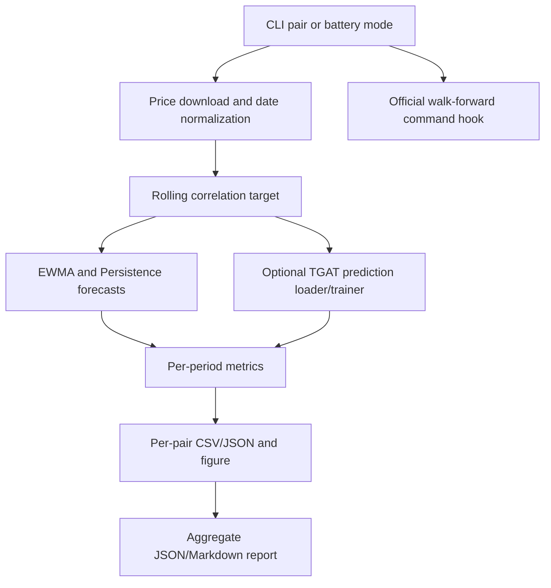

# TGAT vs EWMA Stress Evidence Design

**Spec**: `.specs/features/tgat_ewma_stress_evidence/spec.md`
**Status**: Draft

---

## Architecture Overview

The feature extends the existing COVID event-study path into a reusable stress-evidence runner. The runner downloads prices, computes causal rolling-correlation targets and autoregressive baselines, optionally loads/trains TGAT predictions, writes per-pair artifacts, and creates an aggregate report. It does not alter model internals or the official bootstrap runner.



## Code Reuse Analysis

### Existing Components to Leverage

| Component | Location | How to Use |
| --------- | -------- | ---------- |
| COVID event-study helpers | `scripts/event_study_covid.py` | Reuse download, baseline prediction, TGAT CSV loading, plotting constants, and COVID date constants. |
| Existing SPY-VIX script | `scripts/run_spy_vix_covid_compare.py` | Generalize rather than create an unrelated runner. Preserve SPY-VIX as default. |
| TGAT training pipeline | `scripts/train_link_prediction.py` | Use `save_preds_path` to export pair predictions when optional training is requested. |
| Prepared data loader | `scripts/run_bootstrap_eval_v5.py` | Reuse `load_or_prepare_data` and TGAT hyperparameters for optional training. |
| Official walk-forward runner | `scripts/run_bootstrap_eval_temporal_kg_rev3.py` | Provide command hook with `--variants tgat ewma persistence --n_tickers 50 --step_days 125`. |
| DCC baseline diagnostic | `scripts/run_wf_dcc_baselines.py` | Reference in methodology as evidence that EWMA strength is tied to smooth autoregressive labels. |
| S&P 50 universe | `dyfo/core/ticker_registry.py` | Use `TICKERS_50` as the primary validated universe and append cross-asset pair tickers. |

### Integration Points

| System | Integration Method |
| ------ | ------------------ |
| Yahoo Finance | Use existing `_download_prices` for SPY, VIX, ETFs, GLD, TLT, and BTC. |
| TGAT prediction CSVs | Load via `_load_dyfo_preds(csv_path, a, b)` using `src`, `dst`, `date`, `pred`. |
| Output filesystem | Write figures under `figures/` and evidence artifacts under `results/stress_event_compare/` by default. |
| Official evaluation | Print or run the rev3 command; do not modify rev3 defaults or delta-target state. |

---

## Components

### CLI and Pair Selection

- **Purpose**: Select one pair or the fixed stress-event battery.
- **Location**: `scripts/run_spy_vix_covid_compare.py`
- **Interfaces**:
  - `--mode {pair,battery}` selects single-pair or batch mode.
  - `--pair TICKER_A,TICKER_B` evaluates one custom pair.
  - `--pairs A,B C,D ...` overrides the default battery.
- **Dependencies**: `argparse`; default stress pair list.
- **Reuses**: Existing SPY-VIX default behavior.

### Data Normalization and Forecast Builder

- **Purpose**: Download prices, normalize date indexes, compute rolling-correlation targets, EWMA, and Persistence.
- **Location**: `scripts/run_spy_vix_covid_compare.py`
- **Interfaces**:
  - `_as_datetime_index(obj) -> obj`
  - `_rolling_corr_pair(prices, a, b, window) -> pd.Series`
  - `_ewma_prediction(actual, EWMA_ALPHA) -> pd.Series`
  - `_persistence_prediction(actual) -> pd.Series`
- **Dependencies**: `pandas`, `numpy`, Yahoo Finance through existing helper.
- **Reuses**: `event_study_covid.py` baseline helpers.

### Optional TGAT Prediction Provider

- **Purpose**: Load existing TGAT predictions or train TGAT for the selected pair only when requested.
- **Location**: `scripts/run_spy_vix_covid_compare.py`
- **Interfaces**:
  - `--skip_tgat` disables TGAT loading/training.
  - `--tgat_preds PATH` loads precomputed predictions.
  - `train_tgat_and_save_preds(pair, epochs, seed, save_preds_path) -> None`
- **Dependencies**: `DyFOConfig`, `DataConfig`, `train_link_prediction`, `load_or_prepare_data`.
- **Reuses**: Existing TGAT training and `save_preds_path`.

### Metrics Engine

- **Purpose**: Compute honest global and stress-period metrics for each model.
- **Location**: `scripts/run_spy_vix_covid_compare.py`
- **Interfaces**:
  - `compute_pair_metrics(actual, predictions, vix) -> dict`
  - `_metrics_for_period(actual, pred, idx) -> dict`
  - `_lag_to_threshold(actual, pred) -> float`
  - `_turning_point_delay_days(actual, pred) -> float`
- **Dependencies**: COVID date constants, VIX high-volatility mask.
- **Reuses**: Existing causality convention where forecasts are shifted one day.

### Artifact Writer and Figure Generator

- **Purpose**: Persist per-pair predictions/metrics and create event-study figures.
- **Location**: `scripts/run_spy_vix_covid_compare.py`
- **Interfaces**:
  - `save_pair_predictions(path, actual, ewma, persistence, tgat, vix) -> None`
  - `make_pair_figure(pair, prices, actual, ewma, persistence, vix, tgat, out_dir) -> None`
- **Dependencies**: `matplotlib`, output directories.
- **Reuses**: Existing COVID palette and event-date annotations.

### Aggregate Reporter

- **Purpose**: Summarize pair-level evidence into JSON and Markdown for paper-writing.
- **Location**: `scripts/run_spy_vix_covid_compare.py`
- **Interfaces**:
  - `aggregate_results(pair_results, results_dir) -> dict`
  - `write_markdown_report(summary, path) -> None`
  - `official_walk_forward_command() -> str`
- **Dependencies**: Per-pair metric dictionaries.
- **Reuses**: Official rev3 runner command and conservative claim framing.

---

## Data Models

### Pair Predictions CSV

```text
date, actual, ewma, persistence, tgat, vix, high_vix_day
```

**Relationships**: One CSV per evaluated pair. `tgat` may be empty when predictions are unavailable or skipped.

### Pair Metrics JSON

```json
{
  "pair": ["SPY", "^VIX"],
  "metrics": {
    "ewma": {
      "full_test": {"n": 120, "mae": 0.0, "mse": 0.0, "r_squared": 0.0, "spearman": 0.0, "directional_accuracy": 0.0},
      "covid_crash": {},
      "stress_mae": 0.0,
      "lag_to_threshold": 0.0,
      "turning_point_delay_days": 0.0
    },
    "persistence": {},
    "tgat": {},
    "comparison": {
      "tgat_event_window_win": false,
      "tgat_lag_reduction_days": null
    }
  }
}
```

### Aggregate Summary JSON

```json
{
  "claim": "EWMA remains a strong smooth autoregressive baseline...",
  "n_pairs": 8,
  "n_pairs_with_tgat": 1,
  "tgat_event_window_wins": 0,
  "tgat_event_window_win_rate": 0.0,
  "mean_tgat_lag_reduction_days": null,
  "pairs": [],
  "official_walk_forward_command": "python scripts/run_bootstrap_eval_temporal_kg_rev3.py --variants tgat ewma persistence --n_tickers 50 --step_days 125"
}
```

---

## Error Handling Strategy

| Error Scenario | Handling | User Impact |
| -------------- | -------- | ----------- |
| Missing pair price column | Raise a clear runtime error naming missing tickers. | User can adjust pair or data source. |
| Missing VIX in multi-ticker download | Fetch `^VIX` separately. | High-VIX masks remain available. |
| Missing TGAT prediction rows | Warn and continue with EWMA/Persistence. | Report is still useful and marks TGAT unavailable. |
| Undefined Spearman due to constant series | Return unavailable/null. | No crash from statistical edge cases. |
| Sparse date overlap | Drop only missing aligned observations for each metric. | Metrics remain causal and reproducible. |
| Expensive walk-forward run | Require explicit `--run_walk_forward_protocol`. | Prevents accidental long CPU runs. |

---

## Tech Decisions

| Decision | Choice | Rationale |
| -------- | ------ | --------- |
| Primary script | Extend `run_spy_vix_covid_compare.py` | Keeps existing SPY-VIX workflow discoverable and avoids duplicate scripts. |
| Battery defaults | Eight fixed cross-asset pairs | Covers volatility, crypto, gold, bonds, broad tech, energy, and sector exposure. |
| Default TGAT behavior | Optional; `--skip_tgat` makes smoke tests baseline-only | Enables fast validation and avoids accidental expensive training. |
| Claim framing | Stress adaptation, not global R2 dominance | Matches existing results where EWMA is strong on smooth labels. |
| Official protocol command | `tgat ewma persistence`, S&P 50, non-overlapping windows | Aligns with `.specs/codebase/TESTING.md` and avoids delta-target contamination. |
| Date handling | Normalize timezone-naive `DatetimeIndex` | Prevents pandas slicing errors across Yahoo Finance outputs. |
