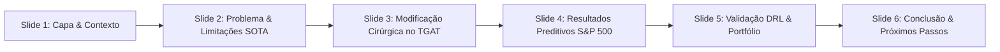

# Guia de Apresentação & Notas de Slide — BRACIS

> **Artigo:** *DyFO: Heterogeneous Temporal Graph Attention with Typed Edge Conditioning for Financial Co-movement Forecasting*  
> **Tema Central:** Previsão Causal de Co-movimentos e Matrizes de Covariância em Redes Financeiras Dinâmicas com TGAT Relation-Aware.

---

## 🎯 Mensagens-Chave para a Banca / Audiência

1. **Problema Real em Finanças Quantitativas**: Métodos tradicionais (Pearson móvel, DCC-GARCH) modelam pares de ativos isoladamente e sofrem em regimes de estresse. Modelos puramente estáticos ignoram a temporalidade de choques de mercado.
2. **A Modificação Cirúrgica no TGAT (Relation-Aware TGAT v2)**:
   - O TGAT original (*Xu et al., ICLR 2020*) foi formulado para grafos homogêneos onde todos os vizinhos são tratados igualmente no readout estrutural (`GATConv` padrão).
   - **O Diagnóstico da Falha**: Em redes financeiras heterogêneas, vizinhos estáticos de setor (`SECT`) diluem a atenção de arestas altamente dinâmicas de correlação (`CORR`) e fatores de risco (`FACT`).
   - **Nossa Modificação Cirúrgica**: Introdução de embeddings de tipo de aresta $\mathbf{e}_{ij} \in \mathbb{R}^{16}$ diretamente na formulação de atenção do GAT (`edge_dim`):
     $$\alpha_{ij} = \text{softmax}_j \left( \text{LeakyReLU}\left( \mathbf{a}^T [ \mathbf{W}\mathbf{h}_i \, \Vert \, \mathbf{W}\mathbf{h}_j \, \Vert \, \mathbf{W}_e \mathbf{e}_{ij} ] \right) \right)$$
   - **Vantagens estruturais**:
     - *Sem recorrência (Non-recurrent)*: Ao contrário do TGN (GRU persistent memory que acumula deriva e instabilidade em backpropagation), o TGAT agrega eventos temporais assíncronos sobre ring buffers locais ($k=20$) com *Time2Vec* learnable encoding.
     - *Sem discretização em snapshots*: Ao contrário do ROLAND (que divide em meses discretos), o DyFO processa o fluxo contínuo de eventos diários (preços, earnings, FED decisions, macro releases).
3. **Validação Empírica & Comparação com Baselines**:
   - **Acurácia Preditiva ($N=50$ ativos do S&P 500, 11 setores GICS, 9 janelas Walk-Forward)**:
     - DyFO (TGAT v2): $R^2 = 0.893$, Spearman $\rho = 0.958$, $\text{MAE} = 0.035$, $\text{cls-F1} = 0.793$.
     - GAT-Static: $R^2 = 0.565$, Spearman $\rho = 0.902$.
     - ROLAND: $R^2 = 0.390$, Spearman $\rho = 0.752$.
     - *Testes de Hipótese*: Teste Diebold-Mariano (HAC Newey-West) e Wilcoxon com correção Holm-Bonferroni confirmam superioridade preditiva estatisticamente significante ($p < 0.0001$).
   - **Utilidade em Otimização de Portfolio (DRL Walk-Forward)**:
     - **DyFO-DRL vs EWMA-GMVP**: O DyFO supera o baseline fechado EWMA-GMVP em retorno acumulado pareado com **67% de win rate** ($p < 0.001$, bootstrap CI95 $[+0.67, +2.68]$) e entrega maior Calmar ratio.
     - **Evidência de Alocação Não-Trivial**: DyFO aprende distribuição seletiva e concentrada ($\text{entropy} = 2.57-2.61 < \ln 18 = 2.890$, $\text{HHI} > 1/18$), enquanto modelos DRL sem grafo (**Raw-DRL**) colapsam monotonicamente para a alocação uniforme $1/N$ ($\text{entropy} = 2.890$).
     - **Regimes de Estresse (COVID-19)**: No crash de 2020, o DyFO rastreia prontamente a decorrelação não-linear entre SPY e ^VIX sem convergir para médias estáticas.

---

## 📊 Roteiro Sugerido de Slides

### Slide 1: Motivação & Formulação do Grafo Heterogêneo
- **Título:** *Previsão de Co-movimento Financeiro em Tempo Contínuo com Grafos Heterogêneos*
- **Pontos:**
  - 50 ativos S&P 500 cobrindo os 11 setores GICS.
  - 4 classes de arestas: `CORR` (DCC-GARCH time-varying), `SECT` (GICS setorial), `SUPL` (supply chain), `FACT` (Fama-French 5-factor exposure distance).
  - 7 tipos de eventos assíncronos: log-returns, balanços trimestrais, choques de juros (FED), releases macroeconômicos.

### Slide 2: A Modificação Cirúrgica no TGAT (O "Core" Técnico)
- **Visual:** `figures/bracis_slides/slide_01_tgat_v2_architecture.png`
- **Falas do Apresentador:**
  > *"O TGAT original de Xu et al. (ICLR 2020) foi construído para grafos homogêneos. Quando aplicamos o TGAT a redes financeiras heterogêneas, identificamos uma limitação severa: diluição de atenção. Vizinhos de setor estático (SECT) diluíam o sinal de correlações dinâmicas (CORR). Nossa modificação cirúrgica adicionou condicionamento relacional direto na camada GAT via embeddings de tipo de aresta (edge_dim=16). Isso permitiu à rede modular a atenção dependendo da semântica da relação, eliminando a degradação estrutural sem incorrer no custo de memória persistente recorrente do TGN."*

### Slide 3: Resultados Experimentais Preditivos (9 Janelas Walk-Forward)
- **Visual:** Painel esquerdo de `figures/bracis_slides/slide_02_predictive_and_portfolio_results.png`
- **Tabela Comparativa**:
  | Modelo | $R^2$ | Spearman $\rho$ | MAE | cls-F1 | DM Test ($p$-val) |
  |---|:---:|:---:|:---:|:---:|:---:|
  | **DyFO (TGAT v2)** | **0.893** | **0.958** | **0.035** | **0.793** | — |
  | **DyFO (TGN)** | 0.803 | 0.932 | 0.050 | 0.782 | $< 0.0001$ |
  | **GAT-Static** | 0.565 | 0.902 | 0.078 | 0.509 | $< 0.0001$ |
  | **ROLAND** | 0.390 | 0.752 | 0.086 | 0.426 | $< 0.0001$ |

### Slide 4: Utilidade Prática em Gerenciamento de Portfolio (DRL Walk-Forward)
- **Visual:** Painel direito de `figures/bracis_slides/slide_02_predictive_and_portfolio_results.png`
- **Falas do Apresentador:**
  > *"Para testar se os embeddings do DyFO geram valor econômico além da previsão estatística, avaliamos um agente de Deep Reinforcement Learning (DRL) em walk-forward multianual (18 ativos, 4 classes: ações, bonds, ouro, cripto). O DyFO-DRL superou o benchmark clássico EWMA-GMVP em retorno e Calmar ratio em 67% dos episódios (p < 0.001). Crucialmente, sob o mesmo orçamento de treino, o agente sem grafo (Raw-DRL) colapsa para a alocação ingênua 1/N. O embedding do DyFO é o fator habilitador que permite ao otimizador convergir para alocações eficientes e não-triviais."*

### Slide 5: Rastreamento em Regimes de Crise (Stress Regime)
- **Visual:** `figures/bracis_slides/slide_03_stress_regime_spy_vix.png`
- **Discussão:** Rastreamento dinâmico da relação SPY - ^VIX durante o crash de março de 2020. O modelo captura a rápida mudança de correlação em tempo contínuo sem atraso de lag de snapshot.

---

## 📑 Resumo dos Arquivos de Slide Gerados

| Arquivo de Imagem | Conteúdo do Slide | Formato |
|---|---|---|
| `figures/bracis_slides/slide_01_tgat_v2_architecture.png` | Arquitetura Homogênea vs TGAT v2 Relation-Aware | 16:9 HD (300 DPI) |
| `figures/bracis_slides/slide_02_predictive_and_portfolio_results.png` | Acurácia Preditiva & Métricas de DRL Walk-Forward | 16:9 HD (300 DPI) |
| `figures/bracis_slides/slide_03_stress_regime_spy_vix.png` | Rastreamento SPY-VIX em Regime de Estresse (COVID) | 16:9 HD (300 DPI) |
